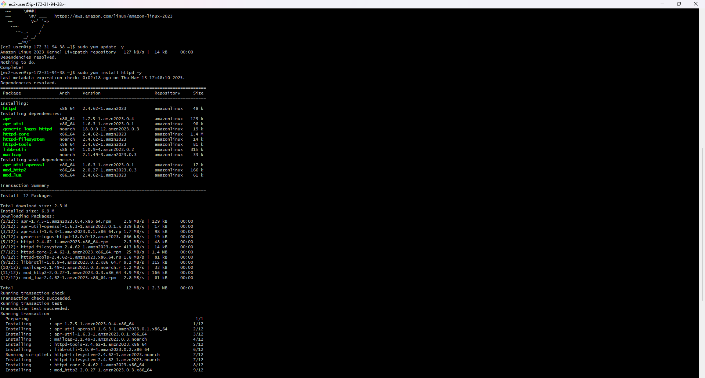
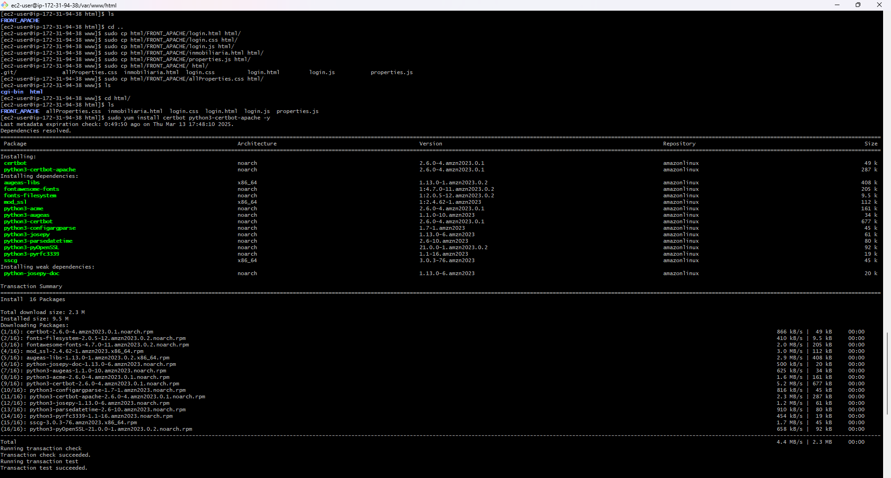
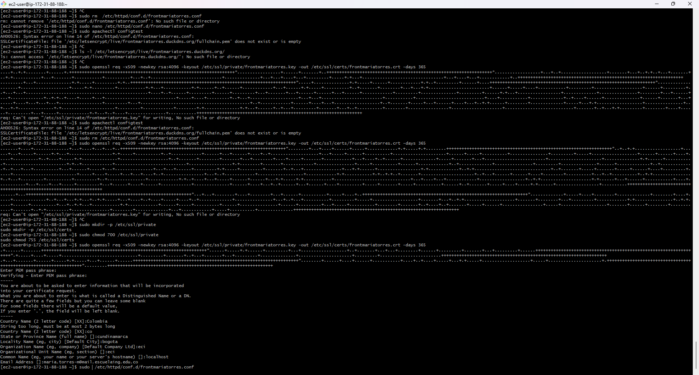

# Property Management System

This project implements a simple CRUD (Create, Read, Update, Delete) system for managing real estate properties using a Spring Boot backend and a frontend built with HTML, CSS, and JavaScript. It allows users to create, update and delete for properties, with data stored in a MySQL database.

## Getting Started

The following instructions will allow you to run the project locally on your machine.

### Prerequisites

You need to have the following installed:

1. **Java** (versions 17 or 21)
   To verify the version in a console or terminal, run:

   ```sh
   java -version
   ```

   The output should look something like this:

   ```sh
   java version "17.0.12" 2024-07-16 LTS
   Java(TM) SE Runtime Environment (build 17.0.12+8-LTS-286)
   Java HotSpot(TM) 64-Bit Server VM (build 17.0.12+8-LTS-286, mixed mode, sharing)
   ```

2. **Maven**
   - To download, visit [here](https://maven.apache.org/download.cgi).
   - Follow the installation instructions [here](http://maven.apache.org/download.html#Installation).
   To verify the installation, run:

   ```sh
   mvn -v
   ```

   The output should look something like this:

   ```sh
   Apache Maven 3.9.9 (8e8579a9e76f7d015ee5ec7bfcdc97d260186937)
   Maven home: /Applications/apache-maven-3.9.9
   Java version: 17.0.12, vendor: Oracle Corporation, runtime: /Library/Java/JavaVirtualMachines/jdk-17.jdk/Contents/Home
   Default locale: es: `CO, platform encoding: UTF-8
   OS name: "mac os x", version: "12.7.6", arch: "x86: `64", family: "mac"
   ```

3. **Git**
   - To download, visit [here](https://git-scm.com/downloads).
   - Verify the installation by running:

   ```sh
   git --version
   ```

   The output should look something like this:

   ```sh
   git version 2.46.0
   ```

4. **Docker**
   - To download, visit [here](https://www.docker.com/).
   - Verify the installation by running:

   ```sh
   docker --version
   ```

   The output should look something like this:

   ```sh
   Docker version 25.0.3, build 4debf41
   ```

### Installation

1. Clone the repository and navigate to the folder containing the `pom.xml` file using the following commands:

   ```sh
   git clone https://github.com/Mar972310/FRONT_APACHE.git
   git clone https://github.com/Mar972310/AREP_SECU.git
   cd AREP_SECU
   ```
2. Create a database in a Docker container using the following command:

```
  docker run -p 3306:3306 --name properties  -e MYSQL_ROOT_PASSWORD=my-secret-pw -d mysql:latest
``` 

3. Build the project:

   ```sh
   mvn clean package
   ```

   The console output should look something like this:

   ```sh
    [INFO] ------------------------------------------------------------------------
    [INFO] BUILD SUCCESS
    [INFO] ------------------------------------------------------------------------
    [INFO] Total time:  21.968 s
    [INFO] Finished at: 2025-03-06T22:51:13-05:00
    [INFO] ------------------------------------------------------------------------
   ```

4. Run the application:

      ```sh
      mvn spring-boot:run
      ```
      The console should display the following message:
      ```sh
      2025-03-06T22:53:31.058-05:00  INFO 64136 --- [bonoParcial] [           main] o.h.e.t.j.p.i.JtaPlatformInitiator       : HHH000489: No JTA platform available (set 'hibernate.transaction.jta.platform' to enable JTA platform integration)
      2025-03-06T22:53:31.259-05:00  INFO 64136 --- [bonoParcial] [           main] j.LocalContainerEntityManagerFactoryBean : Initialized JPA EntityManagerFactory for persistence unit 'default'
      2025-03-06T22:53:31.702-05:00  WARN 64136 --- [bonoParcial] [           main] JpaBaseConfiguration$JpaWebConfiguration : spring.jpa.open-in-view is enabled by default. Therefore, database queries may be performed during view rendering. Explicitly configure spring.jpa.open-in-view to disable this warning
      2025-03-06T22:53:32.257-05:00  INFO 64136 --- [bonoParcial] [           main] o.s.b.w.embedded.tomcat.TomcatWebServer  : Tomcat started on port 8080 (http) with context path '/'
      2025-03-06T22:53:32.272-05:00  INFO 64136 --- [bonoParcial] [           main] e.e.a.b.BonoParcialApplication           : Started BonoParcialApplication in 7.566 seconds (process running for 8.16)
      ```


5. Search in the browser https://localhost:8080/home
      
      
      
      
      
      


## Architecture


This system follows a **layered architecture** where each layer has a distinct responsibility. The key layers are:

### **1. Presentation Layer (Frontend)**
   - Technologies: **HTML, JavaScript, CSS**.
   - Handles user interactions.
   - Sends HTTP requests to the backend via APIs.

### **2. Controller Layer**
   - Component: **PropertyController**.
   - Exposes REST endpoints.
   - Receives and processes HTTP requests.
   - Delegates logic to the Service Layer.

### **3. Service Layer**
   - Component: **PropertyService**.
   - Contains business logic.
   - Acts as an intermediary between the Controller and Repository layers.

### **4. Data Access Layer (Repository)**
   - Component: **PropertyRepository**.
   - Communicates with the database.
   - Executes queries, updates, and deletions.

### **5. Database Layer**
   - Technology: **MySQL**.
   - Stores and manages application data.

### **Data Flow in the Layered Architecture**

1. The **user interacts** with the frontend.
2. The frontend sends **HTTP requests** to the **Controller Layer**.
3. The **Controller Layer** processes the request and passes it to the **Service Layer**.
4. The **Service Layer** applies business logic and calls the **Repository Layer**.
5. The **Repository Layer** retrieves or modifies data in the **Database Layer**.
6. The **response** flows back through the layers to the **frontend** for display.


## Class diagram


### 1. **`PropertyServiceInterface`** 
- **Purpose:** This interface defines the contract for the `PropertyService` class. It establishes the methods that must be implemented by any property-related service.
- **Functions:**
  - `createProperty(PropertyDTO propertyDTO) throws PropertyException`: Creates a new property.
  - `getallProperties()`: Retrieves a list of all properties.
  - `getProperty(Long id) throws PropertyException`: Gets a property by its ID.
  - `updateProperty(Long id, PropertyDTO propertyDTO) throws PropertyException`: Updates an existing property.
  - `deleteProperty(Long id) throws PropertyException`: Deletes a property by its ID.

### 2. **`PropertyService`** 
- **Purpose:** This is the implementation class for `PropertyServiceInterface`. It provides the actual business logic for handling properties.
- **Functions:**
  - **Constructor:** Initializes the service with a `PropertyRepository` to interact with the database.
  - `createProperty(PropertyDTO propertyDTO) throws PropertyException`: Creates a new property from the provided DTO and saves it to the database.
  - `getallProperties()`: Returns a list of all properties stored in the repository.
  - `getProperty(Long id) throws PropertyException`: Retrieves a property from the repository by its ID. If not found, throws a `PropertyException`.
  - `updateProperty(Long id, PropertyDTO propertyDTO) throws PropertyException`: Updates an existing property in the repository. If updating fails, throws a `PropertyException`.
  - `deleteProperty(Long id) throws PropertyException`: Deletes a property by its ID from the repository. If it fails, throws a `PropertyException`.
  - `toEntity(PropertyDTO propertyDTO)`: Converts a `PropertyDTO` into a `Property` entity (for database interaction).
  - `toDTO(Property property)`: Converts a `Property` entity into a `PropertyDTO` to return it to the user.

### 3. **`Property`** 
- **Purpose:** Represents a property in the system. This is the entity class that is persisted in the database.
- **Functions:**
  - **Attributes:** 
    - `id`: The unique identifier of the property.
    - `address`: The property's address.
    - `price`: The property's price.
    - `size`: The property's size.
    - `description`: A description of the property.
  - **Constructors:**
    - Default constructor: Initializes a `Property` object with default values.
    - Parameterized constructor: Initializes a `Property` object with specific values (address, price, size, description).

### 4. **`PropertyDTO`** 
- **Purpose:** A Data Transfer Object (DTO) used to transfer property data between application layers, such as between the service and the controller.
- **Functions:**
  - Similar to the `Property` class but specifically used for communication. It contains only the necessary data sent via HTTP (e.g., in request or response bodies).
  - **Attributes:** Same as `Property` (id, address, price, size, description).

### 5. **`PropertyException`** 
- **Purpose:** Custom exception class for handling property-related errors.
- **Functions:**
  - **Static constants:** 
    - `PROPERTY_NOT_FOUND`, `ID_INVALID`, `PROPERTY_NOT_UPDATE`, `PROPERTY_NOT_CREATE`, `PROPERTY_NOT_DELETE`: These constants represent common error messages related to property operations.
  - **Constructors:**
    - `PropertyException(String message)`: Constructor that accepts a message describing the error.
    - `PropertyException(String message, String e)`: Constructor that accepts both a message and additional data (e.g., an ID or specific error details).

### 6. **`PropertyController`** 
- **Purpose:** A REST controller that handles HTTP requests related to properties. It receives HTTP requests, delegates logic to `PropertyService`, and returns appropriate HTTP responses.
- **Functions:**
  - **Constructor:** Initializes the controller with an instance of `PropertyService`.
  - `createProperty(PropertyDTO property)`: Handles POST requests to create a new property. Uses `PropertyService` to create the property and returns the appropriate HTTP response.
  - `allProperty()`: Handles GET requests to retrieve all properties.
  - `getProperty(Long id)`: Handles GET requests to get a property by its ID. If not found, returns a `PropertyException`.
  - `updateProperty(Long id, PropertyDTO property)`: Handles PUT requests to update an existing property. Delegates to `PropertyService` and returns the updated property.
  - `deleteProperty(Long id)`: Handles DELETE requests to remove a property by its ID. Calls the `deleteProperty` method in `PropertyService`.

### 7. **`ViewController`** 
- **Purpose:** A simple controller to render the home view (probably an HTML page) when a request is made to the `/home` endpoint.
- **Functions:**
  - `home()`: Returns the view name (`inmobiliaria`), which is used to render the application's home page.

### 8. **`PropertyRepository`** 
- **Purpose:** Interface for interacting with the database. Extends `JpaRepository` to provide CRUD operations for the `Property` entity.
- **Functions:**
  - **Note:** No explicit methods are defined here since `JpaRepository` provides built-in methods like `save()`, `findById()`, `findAll()`, `deleteById()`, etc.

### 9. **`User Class (Entity)`** 

The User class represents a user entity in the system, mapped to the users table in the database. It includes fields for the user's name, password, and email, and is annotated for use with JPA (Java Persistence API).

#### **Key Annotations:**
- @Entity: Marks the class as a JPA entity, making it eligible for mapping to a database table.
- @Id: Defines the id field as the primary key of the entity.
- @GeneratedValue(strategy = GenerationType.AUTO): Specifies that the id field is automatically generated by the database.
- @Column(nullable = false): Ensures that fields cannot be null in the database.
- @Column(unique = true, nullable = false): Ensures the email field is unique and cannot be null.

#### **Lombok Annotations:**
- @Getter: Automatically generates a getter method for all fields.
- @Setter: Automatically generates a setter method for all fields.
- @NoArgsConstructor: Provides a no-argument constructor, required for JPA entities.
- @AllArgsConstructor: Provides a constructor that accepts all fields as arguments.
- @Data: Combines @Getter, @Setter, @EqualsAndHashCode, @ToString, and @RequiredArgsConstructor into a single annotation.

#### **Fields:**
- *id*: A unique identifier for each user.
- *name*: The user's full name.
- *password*: The hashed password associated with the user.
- *mail*: The user's unique email address.

#### **Constructors:**
- *No-argument constructor*: Required for JPA to work.
- *Custom constructor*: Used to initialize a new User instance with the name, password, and email fields.

---

### 10. **`UserDTO Class (Data Transfer Object)`**

The UserDTO class is a data transfer object (DTO) used to carry data between layers (typically between the controller and the service layer). It contains the same fields as the User entity, but it’s used for easy communication and doesn't have database mappings.

#### **Key Annotations:**
- @Getter: Automatically generates a getter method for all fields.
- @Setter: Automatically generates a setter method for all fields.
- @AllArgsConstructor: Provides a constructor with arguments for all fields.
- @NoArgsConstructor: Provides a no-argument constructor.

#### **Fields:**
- *name*: The name of the user.
- *password*: The password of the user (typically passed as plain text, will be hashed before saving).
- *mail*: The email address of the user.

#### **Constructors:**
- *No-argument constructor*: Required for creating an empty instance.
- *All-args constructor*: Used to initialize the UserDTO with all fields.

---

### 11. **`UserException Class`**

The UserException class is a custom exception used to handle errors related to user operations such as registration and login.

#### **Key Elements:**
- *Constants*: Provides common error messages as constants, e.g., USER_NOT_FOUND, PASSWORD_INVALID, etc.
- *Constructor*: Initializes the exception with a specific error message.

---

### 12. **`UserController Class`**

The UserController class is a REST controller that provides endpoints for user-related operations, such as user registration and login.

#### **Key Annotations:**
- @RestController: Marks the class as a controller where every method returns a response body.
- @RequestMapping("/users"): Maps the controller to the /users base URL.
- @PostMapping: Specifies that methods handle POST HTTP requests.

#### **Methods:**
- *createUser*: Registers a new user by accepting UserDTO in the request body, passing it to the UserService to be saved.
- *login*: Verifies user credentials by comparing the provided email and password with stored values.

---

### 13. **`UserService Interface`**

The UserServiceInterface defines the methods for user-related business logic, including user creation and login verification.

#### **Methods:**
- *createUser*: Registers a new user.
- *login*: Validates user credentials during login.

---

### 14. **`UserService Implementation`**

The UserService class implements the UserServiceInterface and contains the business logic for user registration and login.

#### **Key Elements:**
- *createUser*: Checks if the email is already registered and hashes the user's password before saving to the database.
- *login*: Verifies the user's password by comparing the hashed value from the database.
- *verify*: Checks if the raw password matches the hashed password using BCrypt.

---

### 15. **`WebConfig Class`**

The WebConfig class configures CORS (Cross-Origin Resource Sharing) to allow requests from specified origins to interact with the backend.

#### **Key Annotations:**
- @Configuration: Marks the class as a configuration class.
- *addCorsMappings*: Configures CORS to allow specific origins, HTTP methods, and headers.

---

### 16. **`UserRepository Interface`**

The UserRepository interface extends JpaRepository and provides methods for querying the User entity from the database.

#### **Key Methods:**
- *findByMail*: Finds a user by their email address.

### **Package Structure and Responsibilities:**
- **Controller Layer:** The `PropertyController` and `ViewController` classes handle HTTP requests, delegate business logic to the service layer, and return responses.
- **Service Layer:** The `PropertyService` class implements business logic, interacting with the repository and handling exceptions. It acts as an intermediary between the controller and repository.
- **Model Layer:** The `Property` class represents the database entity, while `PropertyDTO` is used for data transfer between layers.
- **Exception Handling:** The `PropertyException` class manages specific property-related errors, providing customized messages.
- **Repository Layer:** The `PropertyRepository` interface is responsible for database operations.


## Deployment on AWS

This guide will walk you through the process of setting up the environment, configuring Docker, creating the application, and deploying it on AWS.

# Apache Setup and Configuration for Static Files

Follow these steps to install and configure Apache on an EC2 instance, upload static files, and secure the site using HTTPS.

## 1. Install Apache

First, we need to install Apache on the instance.



---

## 2. Start and Enable the Apache Service

Once Apache is installed, start the service and enable it to run on startup.


---

## 3. Install Git and Upload Static Files

We will install Git to manage and upload the static files. The files will be stored in the `/var/www/html/` directory, which is the default directory for Apache.

### Install Git:
bash
sudo yum install git -y


### Upload Files:
Clone the repository or upload your static files to the `/var/www/html/` directory.


---

## 4. Verify Apache and Static Files

After uploading the static files, you can verify that Apache is working and serving the files by navigating to the following URL:
[http://ec2-3-83-113-17.compute-1.amazonaws.com/login.html](http://ec2-3-83-113-17.compute-1.amazonaws.com/login.html)


---

## 5. Install Certbot for HTTPS

Next, we need to install Certbot to configure SSL for Apache.

### Install Certbot:
bash
sudo yum install certbot python3-certbot-apache -y




---

## 6. Create a Domain

Create a domain in [DuckDNS](https://www.duckdns.org/domains) for your site.


---

## 7. Create a Local SSL Certificate

To avoid issues when starting Apache, create a local SSL certificate. You can do this with the following command:

bash
sudo openssl req -x509 -newkey rsa:4096 -keyout /etc/ssl/private/frontmariatorres.key -out /etc/ssl/certs/frontmariatorres.crt -days 365




---

## 8. Enable Ports 80 and 443

Make sure that ports 80 and 443 are open on your machine.

### Run the Certbot Command to Obtain the SSL Certificate:
bash
sudo certbot --apache -d frontmariatorres.duckdns.org


---

### Expected Result

The Certbot command should output the following result:

bash
Saving debug log to /var/log/letsencrypt/letsencrypt.log
Requesting a certificate for frontmariatorres.duckdns.org

Successfully received certificate.
Certificate is saved at: /etc/letsencrypt/live/frontmariatorres.duckdns.org/fullchain.pem
Key is saved at:         /etc/letsencrypt/live/frontmariatorres.duckdns.org/privkey.pem
This certificate expires on 2025-06-11.
These files will be updated when the certificate renews.
Certbot has set up a scheduled task to automatically renew this certificate in the background.

Deploying certificate
Successfully deployed certificate for frontmariatorres.duckdns.org to /etc/httpd/conf.d/frontmariatorres-le-ssl.conf
Congratulations! You have successfully enabled HTTPS on https://frontmariatorres.duckdns.org


---

## 9. Final Result

Now, your site is successfully configured with HTTPS!


### 14. Deployment Video

A video of the complete deployment process is available here:

https://youtu.be/IOVsiB0bP1g


# TEST REPORT - Property Management System

## Autor

Name: Maria Valentina Torres Monsalve

## Date

Date: 06/03/2025

## Test conducted

### PropertyControllerTest

1. **`createProperty_ShouldReturnCreatedProperty`**  
   Verifies that the controller returns a **201 (Created)** status code and the created object when the property is successfully created.

2. **`createProperty_ShouldReturnBadRequest_WhenExceptionOccurs`**  
   Checks that if an exception occurs during creation, a **400 (Bad Request)** status code is returned with the corresponding error message.

3. **`allProperty_ShouldReturnListOfProperties`**  
   Validates that the controller returns a **200 (OK)** status code and a list of properties when fetching all properties.

4. **`getProperty_ShouldReturnProperty_WhenExists`**  
   Confirms that a specific property is retrieved with a **200 (OK)** status code when it exists.

5. **`getProperty_ShouldReturnBadRequest_WhenPropertyNotFound`**  
   Ensures that if the property is not found, a **400 (Bad Request)** status code is returned with an error message.

6. **`updateProperty_ShouldReturnUpdatedProperty`**  
   Verifies that when updating an existing property, a **200 (OK)** status code is returned along with the updated object.

7. **`updateProperty_ShouldReturnNotFound_WhenPropertyDoesNotExist`**  
   Validates that if an attempt is made to update a non-existent property, a **400 (Bad Request)** status code is returned with the error message.

8. **`deleteProperty_ShouldReturnSuccessMessage`**  
   Confirms that when deleting an existing property, a **200 (OK)** status code is returned with the message **"Eliminado con éxito"** ("Successfully deleted").

9. **`deleteProperty_ShouldReturnNotFound_WhenPropertyDoesNotExist`**  
   Ensures that if the property to be deleted does not exist, a **404 (Not Found)** status code is returned with the corresponding error message.

### PropertyServiceTest

1. **`createProperty_ShouldReturnPropertyDTO_WhenSuccessful`**  
   Verifies that when a property is successfully created, the `PropertyDTO` is returned and the repository's `save` method is called once.

2. **`createProperty_ShouldThrowException_WhenRepositoryFails`**  
   Checks that if an exception occurs during property creation (e.g., repository fails), a `PropertyException` is thrown with the expected message.

3. **`getAllProperties_ShouldReturnList_WhenPropertiesExist`**  
   Ensures that when there are properties in the repository, a list of `PropertyDTO` is returned, and the repository's `findAll` method is called once.

4. **`getProperty_ShouldReturnPropertyDTO_WhenFound`**  
   Verifies that when a property is found by its ID, the `PropertyDTO` is returned and the repository's `findById` method is called once.

5. **`getProperty_ShouldThrowException_WhenIdIsNull`**  
   Ensures that when the ID passed to `getProperty` is `null`, a `PropertyException` is thrown with the expected message.

6. **`updateProperty_ShouldReturnUpdatedPropertyDTO_WhenSuccessful`**  
   Validates that when a property is successfully updated, the updated `PropertyDTO` is returned, and the repository's `save` method is called once.

7. **`updateProperty_ShouldThrowException_WhenPropertyNotFound`**  
   Checks that when an attempt is made to update a non-existent property, a `PropertyException` is thrown with the appropriate error message.

8. **`updateProperty_ShouldThrowException_WhenRepositoryFails`**  
   Verifies that if the repository fails while saving the updated property, a `PropertyException` is thrown with the expected message.

9. **`deleteProperty_ShouldCallRepositoryDeleteById_WhenSuccessful`**  
   Confirms that when deleting a property, the repository's `deleteById` method is called once without any exception.


