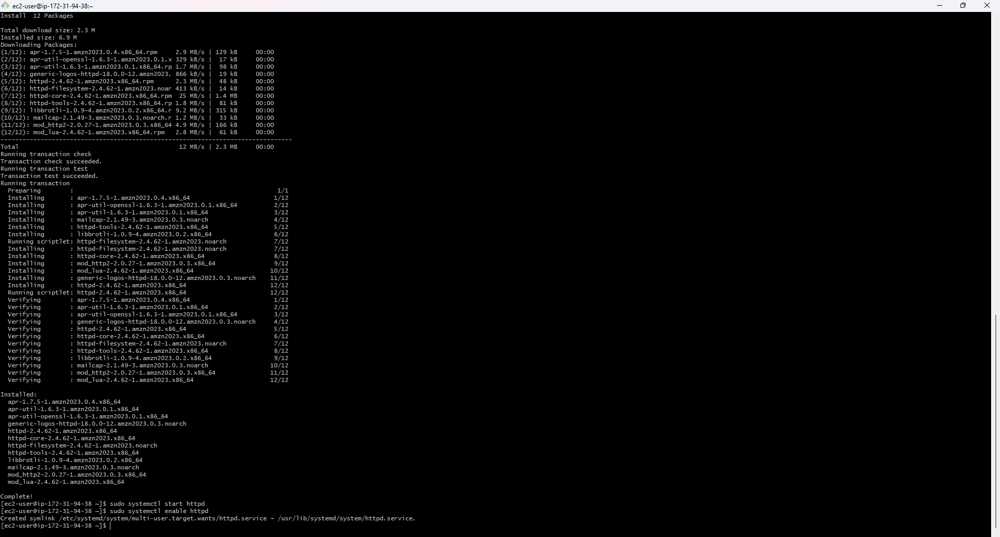
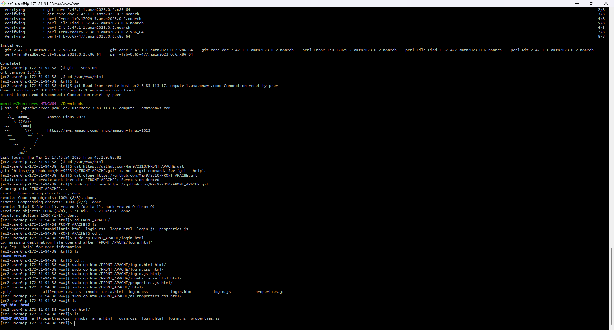

1. tendremos que instalar apache en una instancia, para posteriormente subir los archivos estaticos

2. Iniciamos el servicio y lo habilitamos

3. instalar git para cargar los archivos y los ubicamos "/var/www/html/" que es la ruta que Apache.

4. Ya podemos buscar los archivos confirmando que el servidor Apache este funcionando bien y trayendo los recursos.
"http://ec2-3-83-113-17.compute-1.amazonaws.com/login.html"

Install Certbot and configure Apache to serve content over HTTPS:

sudo yum install certbot python3-certbot-apache -y

- Creamos un dominio en https://www.duckdns.org/domains

sudo certbot --apache -d frontmariatorres.duckdns.org

