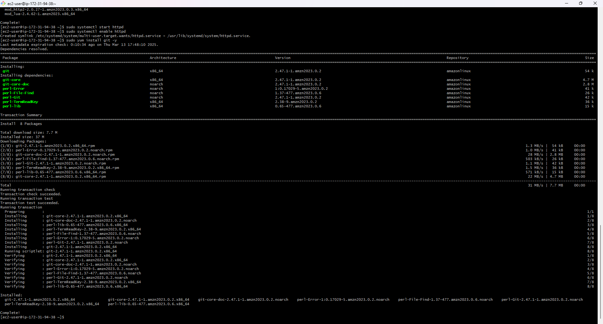
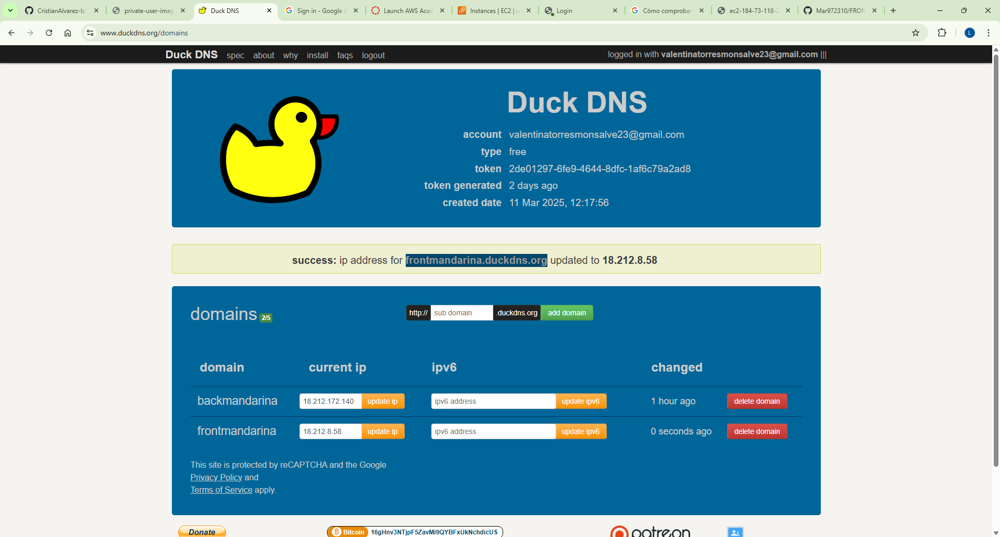
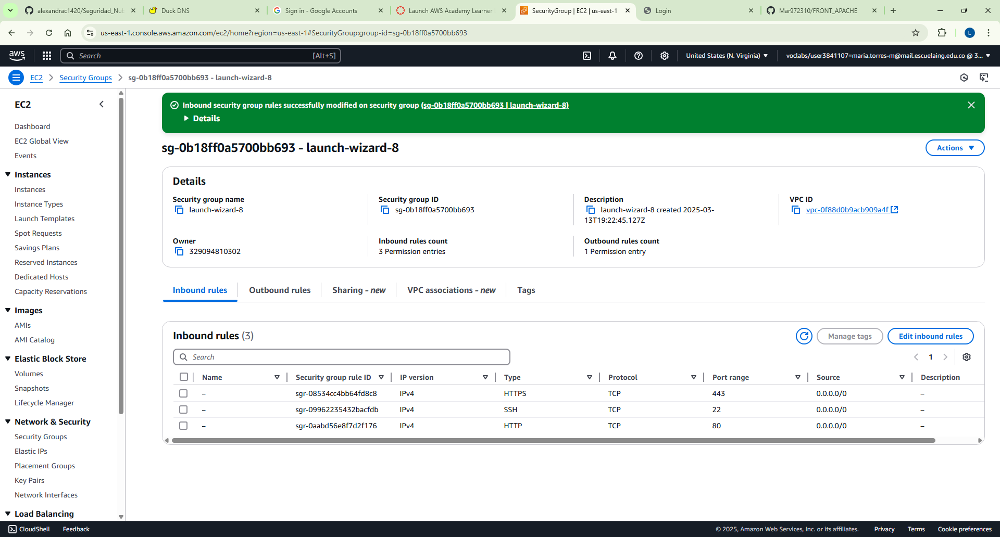
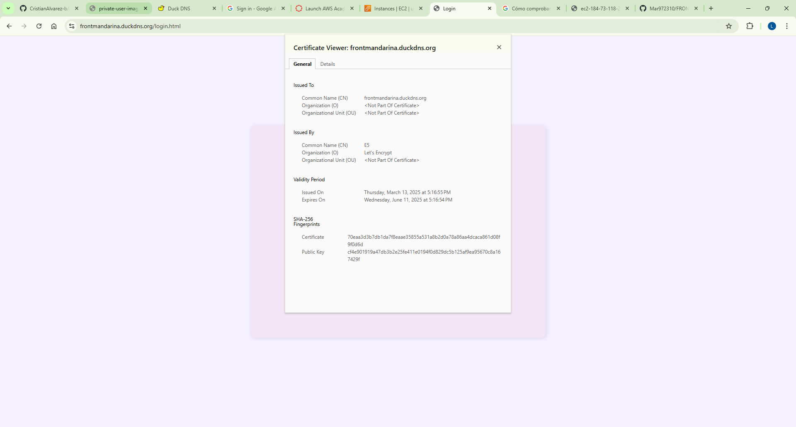

1. tendremos que instalar apache en una instancia, para posteriormente subir los archivos estaticos

2. Iniciamos el servicio y lo habilitamos

3. instalar git para cargar los archivos y los ubicamos "/var/www/html/" que es la ruta que Apache.

4. Ya podemos buscar los archivos confirmando que el servidor Apache este funcionando bien y trayendo los recursos.
"http://ec2-3-83-113-17.compute-1.amazonaws.com/login.html"

Install Certbot and configure Apache to serve content over HTTPS:

sudo yum install certbot python3-certbot-apache -y

- Creamos un dominio en https://www.duckdns.org/domains

creo un certificado local para que no me genere problemas al iniciar apache, luego de agregar la informacion de los virtual
sudo openssl req -x509 -newkey rsa:4096 -keyout /etc/ssl/private/frontmariatorres.key -out /etc/ssl/certs/frontmariatorres.crt -days 365

Habilitamos los puertos de la maquina 80 y 443. Posteriormente ejecutanmos el comando 
sudo certbot --apache -d frontmariatorres.duckdns.org

el resultado esperado es:

Saving debug log to /var/log/letsencrypt/letsencrypt.log
Requesting a certificate for frontmariatorres.duckdns.org

Successfully received certificate.
Certificate is saved at: /etc/letsencrypt/live/frontmariatorres.duckdns.org/fullchain.pem
Key is saved at:         /etc/letsencrypt/live/frontmariatorres.duckdns.org/privkey.pem
This certificate expires on 2025-06-11.
These files will be updated when the certificate renews.
Certbot has set up a scheduled task to automatically renew this certificate in the background.

Deploying certificate
Successfully deployed certificate for frontmariatorres.duckdns.org to /etc/httpd/conf.d/frontmariatorres-le-ssl.conf
Congratulations! You have successfully enabled HTTPS on https://frontmariatorres.duckdns.org

- - - - - - - - - - - - - - - - - - - - - - - - - - - - - - - - - - - - - - - -
If you like Certbot, please consider supporting our work by:
 * Donating to ISRG / Let's Encrypt:   https://letsencrypt.org/donate
 * Donating to EFF:                    https://eff.org/donate-le
- - - - - - - - - - - - - - - - - - - - - - - - - - - - - - - - - - - - - - - -

